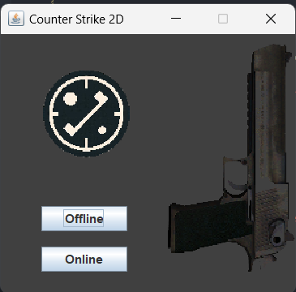
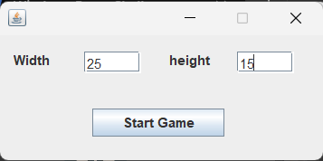
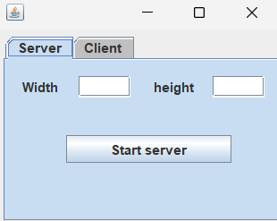
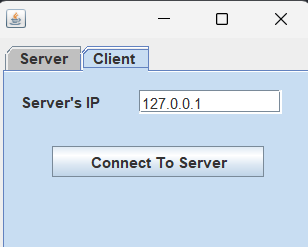
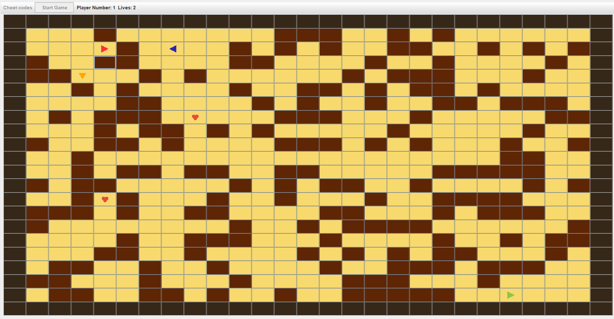

# Counter_Strike_2D

Java Project
2D game with java swing GUI.
One player mode:
1 player with 3 bots.
Multiplayer mode:
2 players in a local network.

# How to run the code

Go to the root directory of the project (Inside the Counter_Strike_2D folder in the repo)

## Create a folder for compiled files

mkdir bin

## Compile all Java files and save the .class files in the "compiled_files" folder

javac -d bin src/game/\*.java

## Run the main file (StartMenu)

java -cp bin/ game.StartMenu

## All the lines

```
mkdir bin
javac -d bin src/game/*.java
java -cp bin/ game.StartMenu
```

# Offline and Online Game Design

## Overview

The project involves designing a 2D multiplayer game with offline and online modes. Players aim to eliminate opponents while navigating a rectangular playing field with random obstacles.

## Offline Mode

### Game Mechanics:

- **Objective**: Players must kill all other players.
- **Field Dimensions**: Rectangular \(n \times m\) field (adjustable in the code) with random obstacles appearing each round.
- **Enemies**: Three computer-controlled enemies spawn randomly on the field.

### Player and Weapon:

- **Lives**: Each player/robot starts with 3 lives and revives with 3 lives.
- **Weapon**:
  - Unlimited range and ammo (bonus for 10-bullet magazine with 3-second reload).
  - Every bullet decreases 1 life upon hitting an opponent.
  - Bullets travel instantly and stop at the first obstacle or opponent in the line of fire.
- **Movement**:
  - Players can move up, down, left, or right.
  - Direction of the player is based on the last movement.

### Additional Features:

- **Shooting Cooldown**: Players can only shoot every 1 second.
- **Obstacles**: Players cannot move into squares with obstacles, and bullets cannot pass through them.
- **Enemy AI**: Enemies perform an action every second:
  - Shoot if another player is in the line of fire.
  - Move to a random square otherwise.
- **Extra Lives**: Every 20 seconds, a random square (without obstacles) spawns an extra life.
  - Players can collect extra lives but cannot exceed 4 lives.

### Death and End of Game:

- **Death**: Players and robots with 0 lives cannot move, shoot, or perform actions until the next round starts.
- **Game End**: The game ends when the player kills all three robots. A message displays the gameplay time, and after 5 seconds, the player returns to the main menu.

## Online Mode

### Game Mechanics:

- Supports 2 players (bonus for implementing up to 8 players).
- **Objective**: Players battle each other under conditions similar to the offline mode.

### Features:

- **Respawn After Death**: Players revive with 3 lives after 5 seconds, appearing at random locations without obstacles. Previous bodies disappear.
- **Frame Rate**: Implementation should run at 20 frames per second.
- **Obstacles and Extra Lives**: Same functionality as offline mode.

## Program Interface

The program provides options:

- **Offline Mode**: Directly starts the game.
- **Online Server Mode**: Waits for another player to connect.
- **Online Client Mode**: Connects to an existing server or displays "No server available" error.

### Gameplay Features:

- Remaining lives and player direction are visible to all players.
- In offline mode, the player is distinguishable from enemies.
- In online mode, players are distinguishable from each other.

### Field Border:

A row around the field is completely filled and inaccessible.

# Screenshots of Pages of the Game

## Start Menu



## Offline Mode Setting



## Online Mode Server Setting



## Online Mode Clinet Setting



## Game Envirenment


